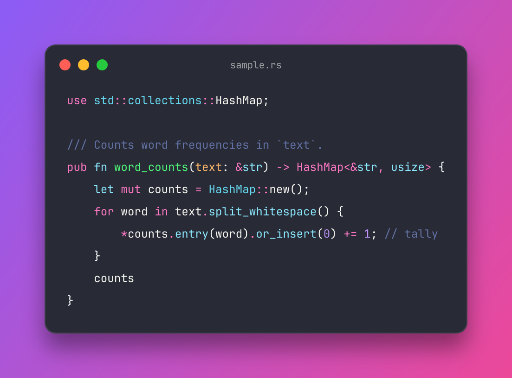

# SnapCode

Beautiful code screenshots for [Zed](https://zed.dev). Select code, press `Ctrl+.` / `Cmd+.`, pick **📸 Snap selection**. The image is copied to your clipboard and saved as a PNG.



## How it works

Zed extensions can't draw custom UI or read the selection, so SnapCode ships a small native **language server** (`snapcode-lsp`) that attaches to common languages. Zed sends it your selection when you open the code actions menu; running the action renders the image natively (syntax highlighting with [syntect](https://github.com/trishume/syntect) and themes from [bat](https://github.com/sharkdp/bat)).

The extension downloads the right `snapcode-lsp` binary from GitHub releases on first use. If `snapcode-lsp` is already on your `PATH`, that one is used instead.

## Usage

1. Select code.
2. `Ctrl+.` (Linux/Windows) or `Cmd+.` (macOS).
3. Choose **📸 Snap selection** or **📸 Snap selection (with line numbers)**.
4. Paste anywhere. The file is saved in `~/Pictures/snapcode` by default.

## Settings

All settings are optional. Put them in Zed's `settings.json`:

```jsonc
"lsp": {
  "snapcode": {
    "initialization_options": {
      "theme": "Dracula",                     // see list below
      "background": ["#8B5CF6", "#EC4899"],   // "#RRGGBB", gradient pair, or "transparent"
      "padding": 48,
      "window_controls": true,
      "show_filename": true,
      "line_numbers": false,
      "font_size": 16,
      "scale": 2,                             // 2 = retina quality
      "shadow": true,
      "tab_width": 4,
      "max_lines": 300,
      "max_columns": 200,
      "output_dir": "~/Pictures/snapcode",
      "save_file": true,
      "copy_to_clipboard": true,
      "open_after_snap": false                // open the PNG in Zed afterwards
    }
  }
}
```

**Themes:** Dracula, One Dark (`TwoDark`), OneHalfDark, OneHalfLight, Monokai Extended, GitHub, Nord, Solarized (dark), Solarized (light), gruvbox-dark, gruvbox-light, Catppuccin Mocha/Macchiato/Frappe/Latte, Sublime Snazzy, zenburn, base16-ocean.dark and more. Run `snapcode-lsp themes` for the full list. Names are case- and punctuation-insensitive.

## Command line

The binary also works on its own:

```sh
snapcode-lsp render --file src/main.rs --out main.png
snapcode-lsp render --file src/main.rs --start-line 10 --theme nord --copy
snapcode-lsp render --text "$ZED_SELECTED_TEXT" --file "$ZED_FILE" --config '{"background":"#1e293b"}'
```

### Alternative: task + keybinding

If you'd rather bind a key than use the code actions menu, add a task in `~/.config/zed/tasks.json`:

```json
[
  {
    "label": "Snap selection",
    "command": "snapcode-lsp",
    "args": ["render", "--file", "$ZED_FILE", "--text", "$ZED_SELECTED_TEXT", "--copy"],
    "reveal": "never",
    "hide": "on_success"
  }
]
```

and in `keymap.json`:

```json
[
  {
    "context": "Editor",
    "bindings": { "ctrl-alt-s": ["task::Spawn", { "task_name": "Snap selection" }] }
  }
]
```

On Linux the CLI process exits right after copying, which can clear the clipboard. Use the code action (the language server stays running) or rely on the saved file.

## Troubleshooting

- **No "Snap selection" action.** Make sure some text is selected. If a language has its server list set explicitly, add `snapcode`:
  ```jsonc
  "languages": { "Rust": { "language_servers": ["rust-analyzer", "snapcode", "..."] } }
  ```
  Logs: run `zed: open log` and search for `snapcode`.
- **Clipboard empty on Linux/Wayland.** The image is always saved to `output_dir` too. Wayland clipboard needs a compositor that supports `wlr-data-control` / `ext-data-control`.
- **Language not covered.** The server is registered for ~60 languages (see `extension.toml`). Open an issue or PR to add more.

## Development

```sh
cargo test --workspace                          # renderer + server tests
cargo install --path snap-lsp                   # puts snapcode-lsp on PATH
cargo build --target wasm32-wasip2 --release    # extension (Zed does this itself)
```

Then in Zed: **zed: install dev extension** and pick this folder. Start Zed with `zed --foreground` to see logs.

Layout:

- `src/lib.rs`: the Zed extension (WASM). Finds or downloads the server binary.
- `snap-core/`: the renderer (`render(code, lang, file, options) -> image`).
- `snap-lsp/`: the language server and CLI (`snapcode-lsp`).

## License

MIT. Bundles [JetBrains Mono](https://www.jetbrains.com/lp/mono/) (SIL Open Font License, see `snap-core/fonts/OFL-JetBrainsMono.txt`).
